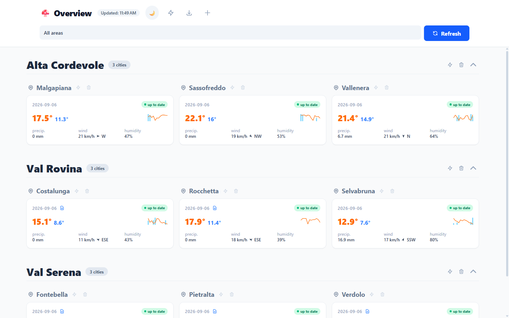
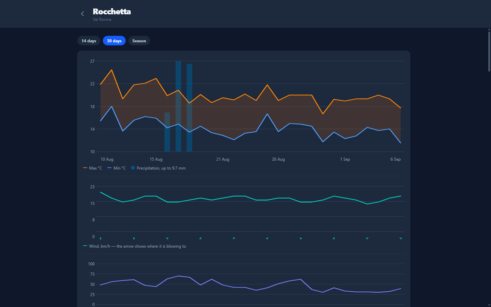

# 🍄 Geo Mushrooms

A full-stack web app that reads a **daily historical weather archive** for a set of
alpine towns, stores one row per city per day, and charts it per city and per region.
A scheduled job collects the newest published days once a day; the UI lets a forager
judge the conditions themselves — temperature, precipitation, wind, humidity — and
annotate any day with a field note.

> **Stack:** Nx monorepo · NestJS 11 · Angular 22 (zoneless, standalone, signals) ·
> Prisma + PostgreSQL · Tailwind 4 · Docker.

<p align="center">
  
</p>

<p align="center">
  
</p>

---

## Try it in five minutes

```sh
cp .env.example .env      # the defaults work as-is for a local demo
docker compose up -d
```

Open <http://localhost> and sign in with the `ADMIN_EMAIL` / `ADMIN_PASSWORD` from your
`.env` (`admin@example.com` / `admin_password_123` out of the box).

That is the whole setup. The backend applies migrations on start and, finding an empty
database, writes a demo dataset — three regions, nine towns, ~180 days of weather each,
an admin user and a few notes. It is skipped entirely once cities exist, so a restart
never disturbs data you have.

> Port 80 already taken? Set `HTTP_PORT` in `.env`.

### Where the data comes from

The archive is **synthetic**, generated in-process by
[`SyntheticArchiveProvider`](apps/api/src/ingestion/sources/synthetic/synthetic.provider.ts).
No third-party service is called, so there is nothing to sign up for and nothing to rate
limit.

It is a real adapter rather than a stub: it implements the same
[`ArchiveProvider`](apps/api/src/ingestion/archive-provider.ts) contract a
network-backed source would, honours the same publication lag, and raises the same
errors — so the ingestion run driving it is the run that would drive a live archive.
See [**The provider seam**](#the-provider-seam) below.

The weather itself is a pure function of `(town, date)` — a seasonal baseline plus
correlated noise — so it reads as weather rather than as `Math.random()`, and
re-collecting a month converges on the same values instead of churning them.

---

## Features

- **Daily ingestion** — a cron job collects the months spanning a lookback window and
  upserts one `DailyObservation` per city per day, keyed `(cityId, date)`, so
  re-collecting a month converges instead of duplicating.
- **The archive stops at D-3, and the whole app is built around it.** Daily archives
  withhold their most recent days while they are validated, so the freshest day that can
  exist is *three days ago*, not yesterday. That one fact shapes the schema (`date` is a
  calendar day), the run planner (it anchors on the archive's edge, never the calendar's)
  and the UI (a city is "up to date" when its latest day *is* that edge). Reading the edge
  as yesterday marks every city stale for ever.
- **Season backfill** — one trigger seeds April through the archive edge for every city.
  Months already stored in full are skipped without a request, which makes retrying an
  interrupted backfill nearly free.
- **Hand-rolled SVG charts** — a sparkline per city and temperature / precipitation /
  wind / humidity charts per city page, with the coordinate maths computed in signals and
  bound declaratively. No charting dependency; the geometry is unit-tested.
- **Precipitation keeps its unit** — archives send millimetres of rain but centimetres of
  snow, so the amount and its unit are stored together and the UI labels the value from
  the stored unit. Collapsing them into one "mm" column would silently mix the two.
- **Region / city fan-out** — trigger a collection for a single city or a whole region.
- **Tracked collection runs** — every run is recorded with live counters, so the UI shows
  a real progress bar instead of asking for a manual refresh. One run at a time;
  interrupted runs are closed on restart.
- **Rate-limit discipline** — requests are paced on purpose, a rate limit costs one
  backoff and one retry rather than a failed city, and a source that can no longer be
  read fails the run *loudly* instead of storing nothing quietly.
- **Per-day notes** — editable field notes attached to any observed day, which survive
  re-collection because the upsert updates in place rather than deleting and reinserting.
- **JWT auth** — all data endpoints are guarded; the Angular client attaches the token
  via a functional HTTP interceptor.
- **Dev tools** — fail-closed, env-gated endpoints for deleting a day's data during
  development.

---

## Architecture

```
apps/
  api/           NestJS backend (REST + Prisma + scheduled ingestion)
  api-e2e/       Backend smoke tests against a running stack
  client/        Angular frontend (zoneless, standalone, NgRx Signals)
  client-e2e/    Playwright E2E tests (hermetic — no backend needed)
libs/
  auth/          data-access (AuthStore, guard, interceptor) + feature-login
  catalog/       data-access (WeatherStore, models) + feature-list +
                 feature-city-detail + ui-card + ui-chart
  shared/        ui-toast (global notifications)
```

Libraries are layered `data-access` / `feature-*` / `ui-*` and wired through `@geo/*`
path aliases; feature libs are lazy-loaded by the router. Apps never import from each
other — `libs/` are the only shared units, with boundaries enforced by Nx.

**Data model** (PostgreSQL via Prisma):

```
Area (1) ─< City (1) ─< DailyObservation (1) ─ Note (1:1)
User         (standalone — authentication only)
IngestionRun (standalone — one collection run and its progress counters)
```

Every metric column is nullable on purpose: one unparsable field must never cost the
whole day, and `0` is a real reading while `null` means "not measured". `date` is a
calendar day (`@db.Date`), not a timestamp.

### The provider seam

Everything the ingestion run does — planning city-months, pacing, the single-flight lock,
idempotent upserts, per-unit error isolation, reconciling runs left behind by a crashed
process — is independent of *where* the days come from. `ArchiveProvider` is the whole of
what it needs from a source:

```ts
openSession(slug)                              // per-run handshake
resolveLocality(slug)                          // slug -> the source's own id
fetchMonth(session, localityId, month, slug)   // one month, already ParsedDay[]
```

Three things make the seam hold, and each is easy to undo by accident:

- **`ParsedDay` is the currency, not a payload.** `fetchMonth` returns normalised days,
  so parsing is a provider concern and the run never learns any source's shape.
- **`ArchiveSession` is opaque.** A source that authenticates per run keeps its key
  there. Threading such a value through the run as a bare `string` would put one source's
  implementation detail into the signature of every collection step — and leave a source
  without a handshake nothing honest to pass.
- **`RateLimitError` / `KeyExtractionError` / `PayloadShapeError` are shared vocabulary.**
  The run reacts to them by name to choose between backing off, aborting, and failing a
  single city-month, so they belong to the contract rather than to any adapter.

The adapter is named in exactly one place — the `useClass` line in
[`ingestion.module.ts`](apps/api/src/ingestion/ingestion.module.ts). Nothing outside
`ingestion/sources/<name>/` may name a source.

---

## Getting started

### Prerequisites

- **Node.js 22+** — Angular 22 requires `^22.22.3 || ^24.15.0 || >=26.0.0`; Node 20 will
  not build this project. The failure on an older Node is an engine warning rather than a
  clear error, and a developer whose local Node is *newer* than the container's will not
  see it at all.
- **npm 11** (`npm install -g npm@11`). Node 22 still ships npm 10.9, and the lockfile is
  an npm 11 artifact, so npm 10 builds a different tree from it and rejects `npm ci` as
  "out of sync" — naming packages that have nothing to do with the problem. Don't
  regenerate the lockfile to work around it: besides fixing nothing, a lockfile rebuilt on
  Windows silently drops the Linux binaries the Docker image needs. Update it in place
  with `npm install`.
- Docker + Docker Compose.

### Run locally (dev servers)

```sh
docker compose up -d db                                   # start the database
npx prisma migrate dev --schema=./apps/api/prisma/schema.prisma
npx prisma db seed                                        # the demo dataset
npx nx serve api                                          # http://localhost:3000
npx nx serve client                                       # http://localhost:4200
```

## Common commands

| Task | Command |
|---|---|
| Serve backend | `npx nx serve api` |
| Serve frontend | `npx nx serve client` |
| Build (prod) | `npx nx run api:build:production` · `npx nx run client:build:production` |
| Unit tests (all) | `npx nx run-many -t test` |
| Unit tests (one) | `npx nx test <project>` (e.g. `api`, `ui-chart`) |
| E2E | `npx nx e2e client-e2e` |
| Lint | `npx nx run-many -t lint` |
| Dependency graph | `npx nx graph` |
| Reseed from scratch | `docker compose down -v && docker compose up -d` |

The everyday ones are npm scripts too: `npm run lint`, `npm test`, `npm run build`,
`npm run e2e`, `npm run serve:api`, `npm run serve:client`. On a fresh clone run
`npm run prisma:generate` before the tests — the API specs import the generated Prisma
client, and nothing generates it for you (a `postinstall` hook would break the Docker
build, which installs before the schema is copied).

### Prisma (always pass `--schema`)

```sh
npx prisma migrate dev --name <name> --schema=./apps/api/prisma/schema.prisma
npx prisma studio --schema=./apps/api/prisma/schema.prisma
```

### CI

`.github/workflows/ci.yml` runs `nx run-many -t lint test build` plus the Playwright suite
on every pull request and on pushes to `master` / `develop`. The E2E suite is hermetic —
route interception stands in for the API — so CI needs no database and no backend.

`apps/api-e2e` is the exception: it smoke-tests a *running* stack, so it is run locally
(`npx nx e2e api-e2e`, with the stack up) rather than in CI.

---

## Collected metrics

One row per city per day, stored as the source sends it:

| Column | Notes |
|---|---|
| `tMin` / `tMax` / `tPerceived` | °C |
| `precipAmount` + `precipUnit` | mm of rain, **cm** of snow — the unit travels with the amount |
| `precipProb` / `precipType` | %, and `p` = rain / `n` = snow / `null` when dry |
| `windSpeed` / `windGust` / `windDirection` | **knots** as stored, 16-point compass; converted to km/h at the point of display |
| `humidity` / `pressure` / `uvIndex` | daily mean % · hPa |
| `zeroThermalM` / `snowLineM` | metres |
| `conditionText` / `symbolId` | short description of the day |

`windGust` is stored but never charted: it is always exactly `windSpeed × 1.4`, so
plotting it would draw a second line parallel to the first and tell the reader nothing.
The column stays because it is what the source sends — if that factor ever varies, that
is itself the news.

## Tech notes

- **Backend:** NestJS with a global `ValidationPipe` (`whitelist` +
  `forbidNonWhitelisted`), `helmet`, env-driven CORS, `ThrottlerModule` (100 req/min),
  and JWT auth. Secrets come from `ConfigService` — no hardcoded fallbacks, and
  `JwtModule.registerAsync` fails fast without `JWT_SECRET`.
- **Frontend:** Angular with zoneless change detection, standalone components, native
  control flow (`@if` / `@for`), `inject()`, and state in root `signalStore`s
  (`@ngrx/signals`). Tailwind with class-based dark mode; mobile-first.
- **Type safety:** every project compiles with `strict`, including all eight libraries.
- **Config:** all environment variables live in `.env` (see `.env.example`); a new one
  must be added to `docker-compose.yml` and `.env.example` in the same change.
